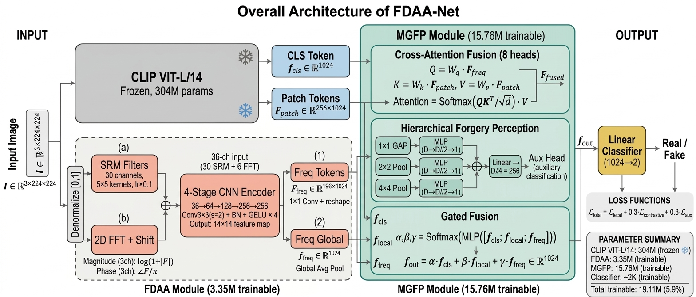

# FDAA-Net Core

Official research code for FDAA-Net, an AI-generated image detection framework built around frequency-aware dual-domain adaptation and multi-granularity fusion.

This release is prepared for paper review and public GitHub sharing. It contains the model implementation, data loaders, training/evaluation scripts, and reproducibility utilities. It intentionally does not include datasets, checkpoints, IDE files, generated reports, logs, or paper drafts.

## Model Architecture



## Highlights

- Frozen CLIP ViT backbone for semantic image representations.
- FDAA modules for frequency-aware dual-domain adaptation.
- MGFP modules for multi-granularity fusion and forgery perception.
- Data loaders for folder-based datasets, GenImage-style datasets, multi-source GenImage training, and Hugging Face streaming datasets.
- Reproducibility scripts for training, evaluation, ablation, robustness, and cross-dataset testing.

## Repository Structure

```text
configs/          YAML/JSON experiment configuration files
data/             Dataset loaders and augmentation pipelines
experiments/      Training, evaluation, inference, and paper experiment scripts
models/           FDAA-Net, FDAA, MGFP, losses, and comparison model wrappers
trainers/         Generic training loop
utils/            Metrics, logging, and checkpoint utilities
visualization/    ROC, attention map, heatmap, and result plotting utilities
DATASET_README.md Dataset preparation notes
requirements.txt  Python dependencies
```

## Installation

```bash
conda create -n fdaa-net python=3.9 -y
conda activate fdaa-net
pip install -r requirements.txt
```

For CUDA-enabled training, install the PyTorch build that matches your CUDA version before installing the remaining requirements.

## Data Preparation

Datasets are not included in this repository. See `DATASET_README.md` for the expected directory layout.

The default local paths are relative to the repository:

```text
datasets/
├── stable_diffusion_v15/
├── midjourney/
├── glide/
└── authoritative/
    ├── GenImage/
    ├── DiffusionForensics/
    ├── CIFAKE/
    └── NTIRE2026/
```

You can override paths either in the YAML files under `configs/` or through environment variables used by the paper experiment script:

```bash
export FDAA_DATASETS_ROOT=/path/to/datasets/authoritative
export FDAA_GENIMAGE_ROOT=/path/to/datasets/authoritative/GenImage
export FDAA_DIFFUSION_FORENSICS_ROOT=/path/to/DiffusionForensics
export FDAA_CIFAKE_ROOT=/path/to/CIFAKE
export FDAA_NTIRE2026_ROOT=/path/to/NTIRE2026
```

If you need a Hugging Face mirror, set it outside the code:

```bash
export HF_ENDPOINT=https://hf-mirror.com
```

## Basic Training

For a simple folder-based training run:

```bash
python experiments/train.py --config configs/default.yaml
```

For the cleaned training configuration:

```bash
python experiments/train.py --config configs/train_config.yaml
```

The generic dataset loader expects folders such as:

```text
dataset_root/
├── train/
│   ├── real/
│   └── fake/
└── test/
    ├── real/
    └── fake/
```

## Paper Experiments

The main reproducibility entry point is:

```bash
python experiments/run_paper_experiments.py --mode all --genimage_root ./datasets/authoritative/GenImage
```

Useful partial runs:

```bash
python experiments/run_paper_experiments.py --mode train_ours
python experiments/run_paper_experiments.py --mode train_sota
python experiments/run_paper_experiments.py --mode ablation
python experiments/run_paper_experiments.py --mode cross_domain
python experiments/run_paper_experiments.py --mode robustness
python experiments/run_paper_experiments.py --mode report
```

For a quick smoke run, reduce the sample count and epochs:

```bash
python experiments/run_paper_experiments.py \
  --mode train_ours \
  --genimage_root ./datasets/authoritative/GenImage \
  --max_samples 100 \
  --epochs 1 \
  --batch_size 8
```

## Evaluation and Inference

Evaluate a checkpoint:

```bash
python experiments/evaluate.py \
  --config configs/default.yaml \
  --checkpoint checkpoints/model_best.pth \
  --data_root ./datasets/test
```

Run inference on one image:

```bash
python experiments/inference.py \
  --checkpoint checkpoints/model_best.pth \
  --image path/to/image.jpg
```

Run inference on a directory:

```bash
python experiments/inference.py \
  --checkpoint checkpoints/model_best.pth \
  --image_dir path/to/images \
  --output outputs/inference_results.json
```

## Notes for Reviewers

- This repository provides code only; it excludes trained weights and datasets.
- Generated outputs are written to `outputs/`, `checkpoints/`, `logs/`, or `results/`, all of which are ignored by Git.
- Large artifacts such as `.pth`, `.pt`, `.ckpt`, `.safetensors`, `.arrow`, `.zip`, and `.npy` files are ignored by default.
- Some cross-dataset scripts download or read Hugging Face Arrow files and therefore require `datasets`, `huggingface-hub`, and `pyarrow`.

## Citation

If you use this code, please cite the corresponding paper. The BibTeX entry will be added after publication.
